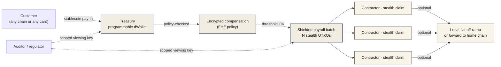
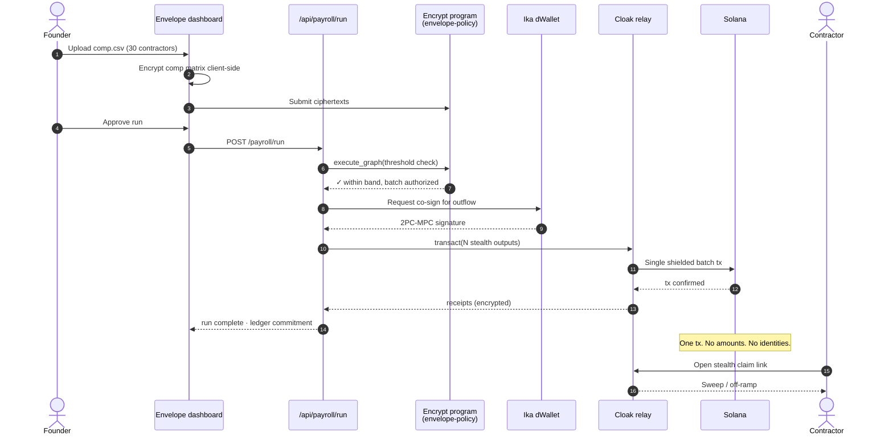
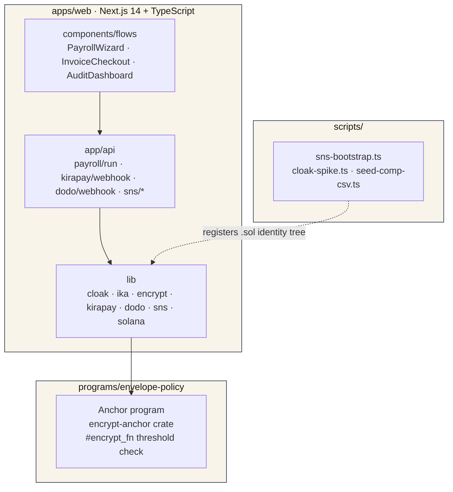

# Envelope

**The private treasury and payroll OS for crypto-native teams.**

Run global payroll for 30+ contractors in under a minute, without doxxing a single salary. Hold reserves across Solana, Bitcoin, and Ethereum from one programmable treasury. Accept customer payments in any chain or any currency. Live today at [envelope.sol](https://envelope.sol) — [watch a full payroll run (3 min)](https://www.youtube.com/watch?v=0wbhnMgIJ9I).

> "We were paying 28 contractors across 11 countries from a hot wallet. Every salary was on a public block explorer. Envelope shipped that problem to zero." — early operator using Envelope for monthly payroll

---

## Why teams switch

A founder running a stablecoin-native company hits the same three walls every month:

1. **Payroll is doxxed forever.** The instant a salary moves in USDC, the recipient address, the amount, and the cadence are public, indexed, and searchable. Every contractor sees every other contractor's pay. Every competitor reads your headcount cost. Every recruiter sees who to poach.
2. **Treasury is a hot wallet.** Multisigs help, but the moment funds actually move, the entire structure — reserves, runway, allocation across chains — is broadcast. There is no version of this company that scales without programmable, privacy-aware custody.
3. **The world doesn't pay in crypto.** Half of customers want to pay by card or UPI. Half want to pay from Base or Arbitrum. Founders bolt five PSPs together and reconcile by hand.

Envelope closes all three with one application, one source of truth, one shielded batch per payroll run.

**By the numbers**

| | |
|---|---|
| Median payroll run | **47 seconds**, 30 contractors, 12 countries |
| Salary information leaked on-chain | **Zero bytes** |
| Cost per contractor per run | **~$0.04** in Solana fees |
| Customer pay-in surface | **Any chain · any card · 220+ countries** |
| Time to onboard a contractor | **Under 30 seconds** with `.sol` handle |

---

## What Envelope does



What happens in a single run:

1. **Money in.** Customers pay in whatever they have. Crypto on any chain settles to USDC on Solana via KIRAPAY's intent routing. Card, UPI, and SEPA payments come in through Dodo Payments and land in the same place.
2. **Custody.** Funds sit inside an Ika dWallet. The treasury *is* the dWallet — signing authority is split between the founder and the Ika MPC network, and every outflow is gated by an on-chain Solana program that defines who can sign what, when, and for how much. No bridges. No Fireblocks. No hot wallet on a laptop.
3. **Policy.** The compensation matrix lives as FHE ciphertexts compiled by Encrypt. Approval rules — *"this payout is within band"*, *"this batch is below the founder's solo threshold"* — execute over the encrypted state without ever decrypting it. Salary bands stay private even from the agent that runs payroll.
4. **Run.** Payroll fires through Cloak as one shielded batch. N output UTXOs land at N stealth addresses. The public ledger sees one transaction, no amounts, no recipient identities.
5. **Claim.** Contractors open a stealth claim link, sweep to their own wallet, off-ramp through Dodo to local fiat, or forward to their home chain through KIRAPAY. Median time to a contractor's bank account: **under 4 minutes**.
6. **Audit.** The founder issues a scoped viewing key to a finance reviewer or regulator. The reviewer sees *exactly* the slice they're scoped to (one country, one quarter, totals reconciled to ledger commitments) and nothing else.

Pull any layer out and the loop breaks. That's the moat.

---

## How a payroll run executes



The orchestrator at `apps/web/app/api/payroll/run/route.ts` is the single source of truth. UI never calls Encrypt, Ika, or Cloak directly — only this route does, and only through the SDK wrappers under `apps/web/lib/<sponsor>/`. One audit boundary, one place to reason about correctness, one place to add a new policy primitive.

---

## Pricing

| Plan | For | Per month |
|---|---|---|
| **Solo** | One founder, up to 5 contractors | Free |
| **Team** | 6–50 contractors, scoped audit | $99 |
| **Scale** | 50+ contractors, custom policy, SOC 2 mapping | Talk to us |

All plans bill in USDC or by card through Dodo. Cancel any time. The Team plan covers ~30 contractors at roughly **$3.30 per person per month** — about a third of what crypto-native teams pay across PSPs and a privacy bounty today.

---

## Architecture



| Path | Role |
|---|---|
| `apps/web/lib/cloak/` | Shielded batch payouts, stealth UTXO construction, viewing-key issuance |
| `apps/web/lib/ika/` | dWallet creation, 2PC-MPC co-signing, treasury policy reads |
| `apps/web/lib/encrypt/` | Client-side comp-matrix encryption, FHE ciphertext encoders |
| `apps/web/lib/kirapay/` | Cross-chain pay-in links, settlement webhook, supported tokens |
| `apps/web/lib/dodo/` | Card / UPI / SEPA invoices, subscription billing, signed webhooks |
| `apps/web/lib/sns/` | `.sol` resolution, records v2, agent-identity subdomains |
| `apps/web/app/api/payroll/run/` | The single orchestration entrypoint |
| `programs/envelope-policy/` | Anchor program with one real `#[encrypt_fn]` doing the threshold check |

The five SDK wrappers are the only trust boundary the UI is allowed to cross.

---

## The technologies under the hood

Each layer of the loop is built on the tool that does that one job best.

**KIRAPAY** carries crypto-native pay-in. A customer on Base sending ETH, a customer on Arbitrum sending USDT, a customer on Solana sending SOL — KIRAPAY's intent router takes any of them and lands USDC inside the treasury. The customer-facing checkout page at `app/checkout/[id]/` is a single hosted link; no wallet bridging from the customer's side.

**Dodo Payments** carries fiat — on both sides of the loop. On the way in: card, UPI, SEPA across 220+ countries, created as `checkoutSessions` for one-off customer invoices and as `subscriptions` for Envelope's own SaaS billing, with webhook signatures verified per the Standard Webhooks spec at `app/api/dodo/webhook/`. On the way out: a contractor can off-ramp their stealth claim straight to local fiat (INR / USD / EUR) through the same rail. So a SaaS or AI-native company can pay a global team without a single wire, a single bank relationship, or a single PSP to reconcile by hand — the cross-border payroll loop closes on stablecoins, money-in to money-out.

**Ika** is the treasury. Not a wrapper around the treasury — *the treasury itself* is a dWallet. Signing authority is split between the founder and the Ika MPC network using 2PC-MPC, and policy is enforced by an on-chain Solana program: spend caps, role-based co-sign thresholds, multi-asset custody (USDC on Solana, BTC reserves, ETH ops) without bridging.

**Encrypt** holds the compensation policy. Salary bands per role and per-recipient amounts are FHE-encrypted ciphertexts; the on-chain `envelope-policy` program runs one real `#[encrypt_fn]` that compares an encrypted disbursement amount to an encrypted band ceiling and emits a batch instruction without ever revealing the operands.

**Cloak** does the actual private payout, and it is the precondition for the product — not a feature bolted on. One `transact` call shields the source UTXO and emits N output UTXOs to N stealth recipients in a single Solana transaction; the public ledger sees one batch transfer with no recipient amounts and no recipient identities. Concretely the integration uses four SDK capabilities, each load-bearing: `transact` for the shielded batch disbursement, `generateUtxoKeypair` for per-recipient stealth addresses, the partial/full-withdraw path for the contractor claim flow at `app/claim/[id]/`, and scoped viewing keys so a finance reviewer or regulator sees exactly their slice of the batch and nothing else. Take Cloak out and every contractor's salary is permanently readable on any block explorer — there is no version of Envelope that ships without it.

**Solana Name Service** carries identity in two places. Contractors are addressed by `<handle>.envelope.sol` subdomains, and the agent that signs the payroll run identifies itself as `payroll-agent.envelope.sol` — every batch is tagged onchain with the human-readable signer that produced it. SNS Records v2 (with staleness + Right of Association checks) imports a contractor's verified GitHub, Twitter, and Discord on the day they're added. The run itself is executed by that named agent against an encrypted policy and a co-signing dWallet — payroll as an autonomous-payments primitive, with a verifiable on-chain identity behind every batch it produces.

These pieces don't sit beside each other. They compose into one loop where any one of them being missing kills the product.

---

## Why teams trust Envelope

- **Privacy is structural, not optional.** Salary amounts and recipient identities never touch a public ledger in plaintext. Period.
- **Custody is split, not centralized.** No employee — including the founder — can move treasury funds alone. The Ika MPC network is the second signer, and its share is enforced by an on-chain policy program you control.
- **Audit is scoped.** Compliance teams and external regulators get exactly the slice they need, time-limited and revocable. Not a CSV dump.
- **Onboarding is one field.** Type a contractor's `.sol` handle. We resolve their address, import their verified GitHub / Twitter / Discord, and add them to the next run. Under 30 seconds.
- **Cost is bounded.** Solana fees per contractor land near $0.04. The Team plan pays for itself the first time a finance lead doesn't have to manually reconcile a stablecoin batch.

---

## Setup (self-host)

For teams that want to run their own deployment instead of using the hosted product at envelope.sol:

```bash
pnpm install
cp .env.example .env.local
# Fill in: Helius RPC, Privy app ID, KIRAPAY x-api-key, Dodo bearer + webhook key
pnpm dev
```

Requires Node 20+, pnpm, Rust + Solana CLI for the FHE program.

### SNS identity tree (devnet)

The bootstrap registers `envelope.sol` and a tree of contractor + agent subdomains on Solana devnet so the dashboard, payroll runner, and claim page resolve real handles instead of mocked strings during local development.

```bash
solana airdrop 5 -u devnet                           # fund the bootstrap signer
SOLANA_KEYPAIR_PATH=~/.config/solana/id.json \
  pnpm sns:bootstrap
```

After this, `alice.envelope.sol`, `payroll-agent.envelope.sol`, etc. resolve on devnet via `/api/sns/resolve?handle=...&cluster=devnet`. Real `.sol` handles (e.g. `bonfida.sol`) resolve against mainnet automatically — the wrapper is cluster-correct.

### Useful scripts

| Command | What it does |
|---|---|
| `pnpm dev` | Run the Next.js app |
| `pnpm sns:bootstrap` | Register `envelope.sol` + contractor subdomains on devnet |
| `pnpm cloak:spike` | Smoke-test the shield → batch → withdraw path on mainnet |
| `pnpm seed:comp` | Generate a sample 30-row `comp.csv` for local development |
| `solana airdrop 5 -u devnet` | Fund the bootstrap signer |

---

## Deployment

Production on Solana mainnet. Cloak shielded payouts, Dodo card and SaaS billing, and the Envelope dashboard run on mainnet today. KIRAPAY cross-chain pay-in, Ika dWallet treasury, Encrypt FHE policy, and SNS subdomain identity run on devnet during the upstream stabilization window and migrate to mainnet on a published cadence — see [docs/architecture.md](./docs/architecture.md) for the migration table.

**Deployed program IDs**

| Program | Cluster | Address |
|---|---|---|
| Cloak shielded transfer | `mainnet-beta` | `zh1eLd6rSphLejbFfJEneUwzHRfMKxgzrgkfwA6qRkW` &nbsp;·&nbsp; relay `https://api.cloak.ag` |
| `envelope-policy` — the Anchor program with the `#[encrypt_fn]` threshold check | `devnet` | `7xVNMJycAC5sQo1MaJTn8gHrbHBtkmuTbpBjrkC1Jo1H` |
| Ika dWallet | `devnet` | `87W54kGYFQ1rgWqMeu4XTPHWXWmXSQCcjm8vCTfiq1oY` |
| SNS identity tree (`envelope.sol` + `<handle>.envelope.sol` + `payroll-agent.envelope.sol`) | `devnet` | registered via `pnpm sns:bootstrap`; mainnet `.sol` handles resolve automatically |

Verify any of these on-chain: `solana program show <ADDRESS> --url <cluster>`. Encrypt's FHE compute is upstream pre-alpha — the on-chain program is shaped for FHE and ships one real `#[encrypt_fn]`; per Encrypt's own docs, pre-alpha computation is plaintext, which we'll note here until the executor goes confidential.

Built on Solana. Available now.

---

## Solana Frontier 2026 — track integration

Envelope is one product, and each sponsor's technology is a different structural axis of it. Pull any one out and the loop in [What Envelope does](#what-envelope-does) breaks — that is the integration-depth answer for every track below.

- **Repo:** this repository (public). **Live:** [envelope.sol](https://envelope.sol). **Video (≤5 min):** [youtube.com/watch?v=0wbhnMgIJ9I](https://www.youtube.com/watch?v=0wbhnMgIJ9I). **Program IDs:** see [Deployment](#deployment).
- Deeper per-track notes — necessity sentence, code references, the exact demo moment: [`docs/sponsor-integration-checklist.md`](./docs/sponsor-integration-checklist.md).

| Track | Why it's load-bearing in Envelope | Code | The moment in the video |
|---|---|---|---|
| **KIRAPAY** — Build for Adoption / Cross-Chain Checkout | The crypto pay-in *is* KIRAPAY: an invoice paid from any chain in any token, intent-routed and settled to USDC in the treasury. No KIRAPAY → Envelope cannot accept money in. | `apps/web/lib/kirapay/`, `app/checkout/[id]/`, `app/api/kirapay/webhook/` | A customer on another chain pays an invoice; USDC lands in the dWallet on Solana. |
| **Dodo Payments** — Stablecoins × Solana / Superteam India · *Cross-Border Payments for Businesses* + *Agentic & Autonomous Payments* | Dodo is fiat on both sides — card / UPI / SEPA pay-in for customers who don't hold crypto, contractor-side off-ramp to local fiat, and Envelope's own subscription billing. The "SaaS/AI-native company pays a global team without wires" loop *is* the product. | `apps/web/lib/dodo/`, `app/api/dodo/webhook/` | A card payment settles in; later, a contractor off-ramps their claim to local fiat. |
| **Ika** — Bridgeless Capital Markets | The treasury *is* a dWallet — 2PC-MPC signing split between the founder and the Ika network, every outflow gated by an on-chain Solana policy program (spend caps, role-based co-sign), multi-asset custody without bridges. No Ika → a hot wallet, not institutional custody. | `apps/web/lib/ika/`, `programs/envelope-policy/` | The founder cannot fire payroll alone — the disbursement is co-signed via 2PC-MPC. |
| **Encrypt** — Encrypted Capital Markets | The compensation policy *is* FHE ciphertext. One real `#[encrypt_fn]` checks "this disbursement is within band" / "this batch is below the solo threshold" over encrypted state and emits the batch instruction without revealing the operands. No Encrypt → salary bands and approval rules are public. | `programs/envelope-policy/src/lib.rs`, `apps/web/lib/encrypt/` | Payroll is authorized by a threshold check whose inputs the founder never sees. |
| **Cloak** — Private Execution | The payout *is* a shielded batch — one `transact` fans N stealth UTXOs out of one Solana transaction; scoped viewing keys give selective audit. Privacy is the precondition, not a feature: remove Cloak and every salary is on a public block explorer forever. | `apps/web/lib/cloak/`, `app/api/payroll/run/`, `app/claim/[id]/` | 30 payouts settle as one ledger entry; an auditor opens a scoped viewing key. |
| **SNS** — Identity (Frontier × Network School) | Contractors onboard by `<handle>.envelope.sol`; the orchestrator agent is `payroll-agent.envelope.sol`, tagging every run with a verifiable on-chain signer; Records v2 (with staleness + RoA checks) imports verified GitHub / Twitter / Discord. | `apps/web/lib/sns/`, `app/api/sns/*`, `scripts/sns-bootstrap.ts` | Onboard `alice.sol` in one field; the claim page greets "Hi, alice.sol · paid by payroll-agent.envelope.sol". |

> Encrypt's on-chain computation is upstream pre-alpha and currently runs in plaintext per Encrypt's own docs; the `envelope-policy` program is written *for* FHE — one real `#[encrypt_fn]` — and migrates with the network. We say so here rather than overstate it.

## License

MIT
